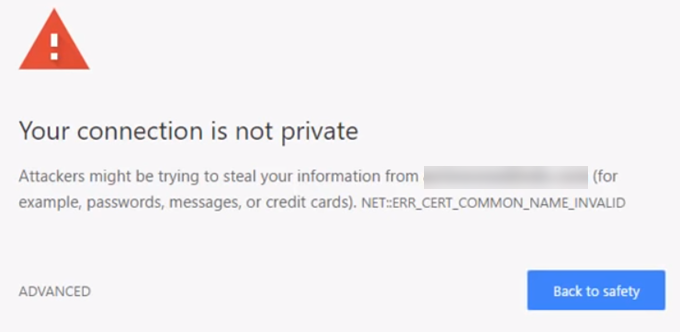

# E-COMMERCE - MICROSERVICES

### Install all packages 

__In terminal. Inside__ _auth, client, expiration,orders, payments, tickets_ __directory__ 

Run

```bash
npm install
```


### Install common package from 

>https://www.npmjs.com/package/@kntickets/common

```bash
npm install @kntickets/common
```

### React - Next.js 

The front-end is avaliable in __client__ directry

### REQUIRED

>skaffold
>docker
>Kubernetes
>Minikube ['Only Linux']

### Configure HOSTS AT

>./infra/k8s/ingress-srv.yaml

Change the host at __line 10__ to your domain in case of production.

__ELSE__

Edit host file of your OS. 

_Host file at_
>MacOs/Linux - /etc/hosts

>Windows - C:\Windows\System32\Drivers\etc\hosts

_ADD_
```host
127.0.0.1 ticketing.dev
```

When opening ticketing.dev on brower you should get Error called __Your connection is not private__ in __chrome__



This error is just caused due to __Kubernetes Ingress Controller Fake Certificate__ _only happens on development_

TYPE

>thisisunsafe

on browser to bypass the error

### VALIDATE STRIPE KEY

In line number 17 of
>./payments/src/test/setup.ts

Enter a valid stripe key for test to pass.

### PAYMENT TIMEOUT FOR USERS

For development reasons payment expiration event is set to 1 Min. For production you can change it at

>./orders/src/routes/new.ts

__CURRENTLY__
```javascript
const EXPIRATION_WINDOW_SECONDS = 1 * 60
```
__CHANGE IT TO 15 MINUTES OR MORE__
I'm setting it to 15 minutes

```javascript
const EXPIRATION_WINDOW_SECONDS = 15 * 60
```


### RUN SKAFFOLD

Skaffold is a command line tool that facilitates continuous development for Kubernetes-native applications. Skaffold handles the workflow for building, pushing, and deploying your application, and provides building blocks for creating CI/CD pipelines.

Run
```bash
skaffold dev
```
in root directory to run in local file

__Learn more about skaffold at__

https://skaffold.dev/docs/quickstart/